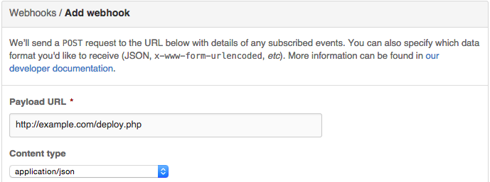

>**UPDATE:** You might find [this newer post]() more helpful.


A while ago I was making a small site with Jekyll, and my workflow looked something like this:

1. Make changes locally
2. Commit changes and push them to a Github repository
3. SSH into the server and pull the changes
4. Use Jekyll to build the new version of the site.

This got pretty old pretty fast so I decided to do something about it. After some googling and researching I came across [Github Webhooks](https://developer.github.com/webhooks/).

Basically this allows you to send HTTP POST payloads to URLs after configurable events on Github. I decided to use this to automate my workflow.

First of all, I set up Github to send data after a 'push' event (the default).

{{}}

After doing this, I then set up the deploy.php script on my server. Looked something a little like this.
``` php
<?php
try
{
  $payload = json_decode($_REQUEST['payload']);
}
catch(Exception $e)
{
  exit(0);
}

//log the request
file_put_contents('github.log', print_r($payload, TRUE), FILE_APPEND);


if ($payload->ref === 'refs/heads/master')
{
  exec('scripts/./build.sh');
}
?>
```
Basically, I'm checking the ref to see if it was the master branch that has been updated (the push event will trigger on a push to any branch). If it is, then it calls a shell script that looks something like this.
``` bash
# Backup previous version of the site in case something borks
rm -r -f ~/www.bak/
cp -r ~/www ~/www.bak

cd ~/www
# Remove any local changes that may have happened
git reset --hard

# Pull changes and build site
git pull
jekyll build
```

This works fine, but isn't any secure. Github supports using [secrets](https://developer.github.com/webhooks/securing/) in the payload to validate that the payload is from Github. I never implemented it myself as it was a small personal project I was pretty certain no one would ever see. But if you want to use this for anything important you should probably pay attention.

Github computes a hash with your secret token (configured when you set up the webhook) using HMAC hexdigest. It's well documented so wouldn't be too hard to implement.

This is only just above the bare minimum for updating using Github webhooks. I highly recommend securing your implementation if you want to use this for something serious!

Stay tuned.
