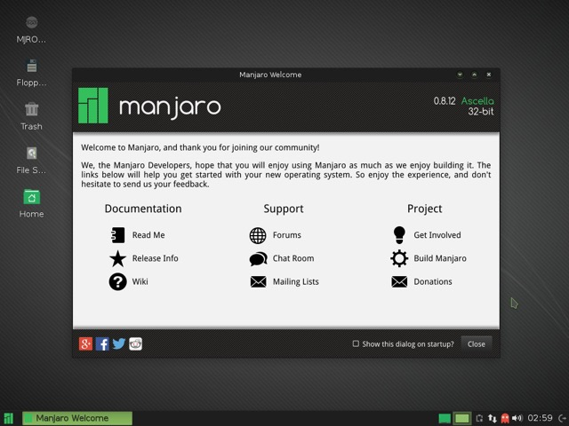
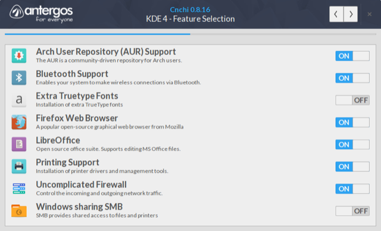
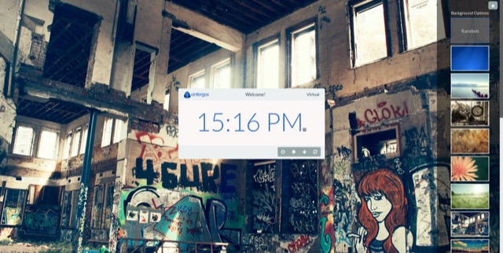
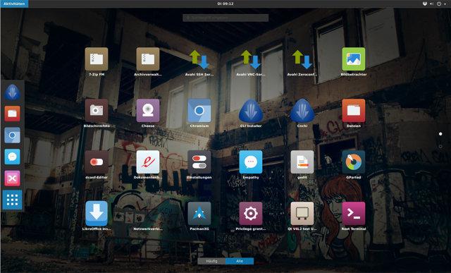

Arch Linux is by far my favourite distro not least because its rolling-release update system means I'm always running the latest and greatest. However, setting up a graphical desktop system and installing some base apps is boring and tedious work. So whilst installing it onto my [Macbook Air (Mid 2013, "6,2")](https://wiki.archlinux.org/index.php/MacBook#Mid_2013_13.22_-_Version_6.2C2) I decided to forgo that busywork and check out the distros that have done that for me. I'll be showing you two distros that I checked out, Manjaro and Antergos.

## Manjaro
First distro I tried was [Manjaro](https://manjaro.github.io/) with XFCE. The goals of the distro are to provide a user-friendly environment that people new to Linux should be able to enjoy. I figured that this could be a good place to start so I spun up a liveUSB and installed it onto a separate partition.

### Desktop
The XFCE desktop is pretty basic, with a bottom panel set up with some applets, and whiskermenu installed. It's usable and functional if a little sparse. All in all, it's something that I might very well have installed if given some time with a base Arch install.

{{}}

*The desktop after startup*

### Community Woes
First problem I ran into was the fact that the graphical installer had overwritten rEFInd with Grub. Not that I have a problem with Grub, but I had a nice rEFInd theme already set up and I didn't fancy configuring it. "No problem" I thought, "I'll just waddle over to the [Manjaro IRC](https://wiki.manjaro.org/index.php?title=Manjaro_IRC) and ask for some help there". Boy was I wrong.

Maybe they dislike newcomers or maybe I asked the wrong question but all I got in response were passive aggressive "You should know how to fix this" responses - the complete opposite of what I am used to with the Linux Community at large. Eventually I was given the (surprisingly simple) command to reinstall rEFInd:

``` bash
$ refind_install
```

Nonetheless though, the IRC had left a nasty taste in my mouth.

### Pre-installed Software
Manjaro comes with a menagerie of pre-installed software, some useful and some a little "huh?". The big surprise for me was finding out that the [Steam Client](https://store.steampowered.com) already there. To me, the inclusion of that software is completely against the Arch ethos of being light and without-cruft.

I asked the IRC why it was included, and the response I got was
>"its for the windows switchers"

which I guess is an answer.

### Thoughts
Considering that it's not hit version 1.0 yet, I think it's made good headway into make a user friendly distro. However a combination of the design choices for included software and the reaction I got with my brief stint with the community is warding me off this one.

## Antergos
After some googling I came across [Antergos](http://antergos.com), a Spanish-developed distro. They offer a choice of 6 different desktops along with a beautiful icon theme from the [numix](https://numixproject.org/) guys. I decided to give it a shot.

### Installation
{{}}

*The login screen with lightdm-webkit-greeter*

They ship their liveCD/liveUSB iso with a custom installer called cnchi, written in Python. When you run it, it automatically downloads the latest version of itself from the Antergos repos and updates. It's a brilliant and smooth system: if it works. Unfortunately like [many others](http://forum.antergos.com/topic/1909/cnchi-never-load-after-update) I had problems connecting to their repos which meant the installation of the latest version of cnchi didn't work.

The following commands force an update
``` bash
$ sudo reflector -l 20 -f 10 --save /etc/pacman.d/mirrorlist
$ sudo pacman -Syy cnchi --force
$ sudo -E cnchi -dv
```

Once you get it running, it's a really easy process and it even pulls the latest changes as it installs, meaning you don't have to update after you install!

### Desktop
{{}}

*The login screen with lightdm-webkit-greeter*

The login screen looks amazing, using lightDM with a webkit greeter. Seriously one of the best looking logins I've seen in quite some time. This is gave me good expectations.

I used the Gnome 3 desktop which although I've not been a fan of in the past looks good and works great with some tweaks.

{{}}

*Numix application icons*

Antergos comes with gnome-tweak-tool already installed meaning you can change some of the basics straight away. Another addition is the Dash to Dock Gnome Shell extension. This gives you a themed dock that fits right in with the rest of the shell.

### Thoughts
I love the base that Antergos provides. Sensible default programs, a myriad of installation options, and the beautiful icon theme mean I'm going to keep this installed on my hard drive for a while longer. I've tweaked it a little with things like [*gnome-shell-extension-topicons*](https://aur.archlinux.org/packages/gnome-shell-extension-topicons/) and a few personal changes and I'm excited to see what else is in the pipes for this distro.

What's your favourite distro? Got any thoughts on my findings? Let me know in the comments below.
