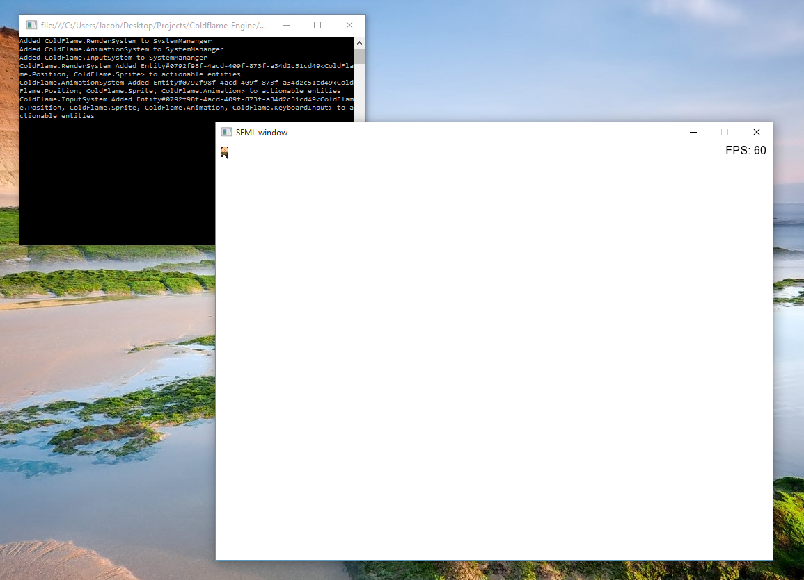

It's been a few months since I last posted, but that doesn't mean I haven't been working on anything! In my [last post](./2015-04-20-my-first-ludum-dare-experience) I mentioned that I was working on a game engine. As of now, it's at a stage where the basic framework is mostly feature-complete!

*Tada!*

ColdFlame is an entity-component driven game engine meant to make adding new features and extending your game a breeze. A single scene is populated by *entities*, which are just an ID associated with a list of *components*. A component, in turn, is just a piece of data about that entity. *Systems*, are classes that act on entities with specific components. For example, the AnimationSystem affects all entities with an Animation component.

In theory, this clear separation of data and behaviour means that you can write very clean, readable and extensible code.

It isn't perfect, the code needs documentation, and there is still a long way to go but feel free to take a look. Contributions are welcome, just send a pull request!

**View the Github Repository for ColdFlame [here](https://github.com/jacobmillward/Coldflame-Engine)**
